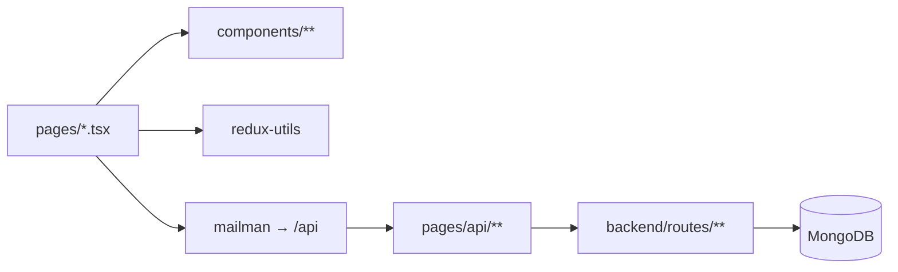

# Architecture & contributor map

Next.js **12** app using the **Pages Router** (`pages/` only). UI talks to **`/api/*`** (mostly via **`mailman`** in `utils/helpers`). Handlers **`dbConnect()`** then call **`backend/routes/*`**. Data is in **MongoDB**.

**Global shell:** `pages/_app.tsx` — `Layout`, NextAuth `SessionProvider`, Redux + persist, styled-components `ThemeProvider`, `Meta`. Pages can set **`noLayout`** (`@types/Page`) to skip chrome.

**Middleware:** `middleware.ts` — optional whole-site lock when `SITE_PASSWORD` is set (`/site-password` + cookie).

**Path aliases:** `tsconfig.json` — `@components/*`, `@utils/*`, `@backend/*`, `@styles/*`, `@redux/*` → `redux-utils/`, `@types/*` → `@types/`.

---

## Directories

| Path | Purpose |
| ---- | ------- |
| `pages/` | Routes. Dynamic: `[id].tsx`. |
| `pages/api/` | HTTP handlers; delegate to `@backend/routes/...`. |
| `components/` | Feature UI; often `*.tsx` + `*.Styled.tsx`. |
| `components/system/` | Shared primitives. |
| `styles/` | Shared styled-components + `globals.css`. |
| `utils/` | Client-safe helpers, constants, API client. |
| `backend/routes/` | API business logic. |
| `backend/utils/` | DB, scoring, `getLocations`, duel/multi helpers. |
| `backend/models/` | Document shapes / types. |
| `backend/queries/` | Read-heavy / aggregation helpers. |
| `redux-utils/` | Store + slices; import `@redux/*`. |
| `@types/` | Domain types (`Game`, `Map`, …). |
| `scripts/` | Seed, map import/export. |
| `tests/` | Jest. |

**New feature:** extend `backend/routes`, add `pages/api/...`, call from UI with `mailman` or `fetch`, add `components/` or `pages/...`.

---

## Where to edit (by flow)

| Area | UI | API / server |
| ---- | -- | -------------- |
| Home | `pages/index.tsx`, `styles/HomePage.Styled.tsx`, hub components | `NEXT_PUBLIC_HOME_MAP_CARDS`; `GET /api/maps/equitable-by-*` |
| Standard play | `pages/map/[id]`, `pages/game/[id]`, `components/gameViews/` | `POST/GET …/api/games`, `backend/routes/games/*` |
| Results | `pages/results/*`, `components/resultCards/` | `pages/api/scores/*` |
| Challenges | `pages/challenge/*`, `daily-challenge/*` | `pages/api/challenges/*`, `pages/api/cron/*` |
| MultiGuessr | `pages/multi/[id]`, `components/multiGameView/`, `GameSettingsModal` | `pages/api/multi/*`, `backend/routes/multi/*` |
| Duels | `pages/duel/*`, `components/duel/` | `pages/api/duels/*`, `backend/routes/duels/*`, `backend/models/duelSession.ts` |
| Equitable streaks | `pages/equitable-streaks` | `backend/utils/getEquitableCountryStreakSourceMapIds.ts` |
| Maps browse | `pages/maps`, `styles/MapsPage.Styled.tsx` | `pages/api/maps/browse/*`, `custom/*` |
| Auth / profile | `pages/login`, `register`, `user/*` | `pages/api/users/*`, NextAuth `pages/api/auth/*` |

**Virtual map IDs** (no per-region Mongo map): `eqcountry-{iso2}`, `eqcontinent-{slug}`. Client parsing: `utils/helpers/equitableCountryMapId.ts`, `equitableContinentMapId.ts`. Server: `backend/utils/getLocations.ts`, `equitableCountryMap.ts`, `getMapFromGame.ts`, bounds JSON under `utils/constants/*BBox.json`.

---

## Client vs server

- Only **`pages/api/*`** (and any RSC-less server-only entrypoints you add) should import code that pulls in **`mongodb`** or Node-only modules.
- Do not import `@backend/**` from browser bundles if it drags in `mongodb`.
- Equitable IDs: **`@utils/helpers/...`** on the client; **`backend/utils/equitableCountryMap.ts`** (and related) from API/server only.

Conventions for this fork (back links, streak rounds, virtual maps): `.cursor/rules/geohub-back-and-streak.mdc` when present in the workspace parent.

---

## Fork vs upstream (high level)

Upstream: **[GeoHub](https://github.com/benlikescode/geohub)** — core game, maps, challenges, accounts.

This repo adds or changes:

| Topic | Summary |
| ----- | ------- |
| Hub UX | `HomeSectionRowCard`, `HomeWorldCard`, equitable grids, `/maps` sections; styling in `HomePage.Styled.tsx`, `MapsPage.Styled.tsx`, `GamifiedHubShell.Styled.tsx`. |
| Virtual equitable maps | `eqcountry-*` / `eqcontinent-*`; lists `GET /api/maps/equitable-by-country|continent`; UI `EquitableCountryRowCard`, `EquitableContinentRowCard`; metadata `getMapFromGame.ts`. |
| MultiGuessr | `MultiGuessrCard` → `GameSettingsModal`; `useGameStartFlow` multi mode; `loadMapPickerOptions`, `MapPickerGrid`, `createMultiSession.ts` (optional `mapId: 'all'`). |
| Duels | `/duel`, Mongo `duelSessions`; `components/duel/`, `duelConstants.ts`, `resolveDuelInvite.ts`; rematch `postDuelRematchReady.ts`. |
| Pickers | `MAP_PICKER_EXCLUDED_IDS`, `officialMaps.json`; world id label `OFFICIAL_WORLD_ID` in `utils/constants/random.ts`. |
| Equitable streaks | `/equitable-streaks`; env `EQUITABLE_COUNTRY_STREAK_MAP_IDS` / `NEXT_PUBLIC_HOME_MAP_CARDS`. |
| Ops | `SITE_PASSWORD` + middleware; `INTERNAL_API_SECRET`, `CRON_SECRET`, `NEXT_PUBLIC_DONATE_URL`; default site name `utils/constants/site.ts`. |

Docker, FAQ, Google Maps setup: **[upstream README](https://github.com/benlikescode/geohub/blob/main/README.md)**.
